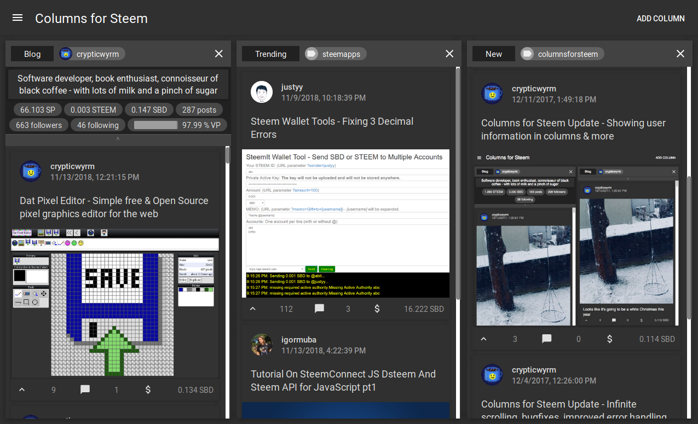

# Columns for Steem

A web based multi column client for [Steem](https://steemit.com/), the decentralized blockchain based social network.

Written in [ClojureScript](https://clojurescript.org/) & [Reagent](https://reagent-project.github.io/) (a thin wrapper on top of React). Uses the [dsteem](https://github.com/jnordberg/dsteem) JavaScript libary to connect to Steem.

The app cam be used right in your web browser (Firefox and Chrome are officially supported) at https://cryptcwyrm.neocities.org/columns/ and decentralized on IPFS at https://ipfs.io/ipns/crypticwyrm.neocities.org/columns/



# How to work on the code

All of the source code you need to touch when working on Columns for Steem is in the file src/columnsforsteem/client.cljs, the other files are just tests and project configuration files so you probably don't need to edit them.

# How to build

You need to have Java 8+ and [boot](http://boot-clj.com/) installed, then you can start the development server from a terminal inside the cloned repository with:

```
boot dev
```

If you have just installed boot you might need to execute the command twice, the first time the boot install script will download and install boot.

After compilation has finished you can see the web app in your browser at http://localhost:8000/index.html

Changes you make are hot loaded into the running website so you can see them instantly without refreshing the browser. It's best to use Google Chrome for Clojure development because that's what all the tools are written for.

The Nightlight editor is integrated in the project, so you can go to http://localhost:4000 to edit the source code right in the web browser. This is the easiest method since you get a properly configured Clojure and ClojureScript REPL, auto complete, parinfer, basically a complete zero configuration development environment.

proto-repl is also installed if you prefer to use Github's Atom text editor instead, but the configuration for that is a lot more involved.

# How to test

To run the tests once, do:

```
boot test-once
```

To automatically run the tests whenever you save in your editor:

```
boot auto-test
```

# How to export for production

```
boot build-simple
```

# Pull requests

Pull requests are welcome, if you send a pull request you agree to license your code as MIT for inclusion in this project.